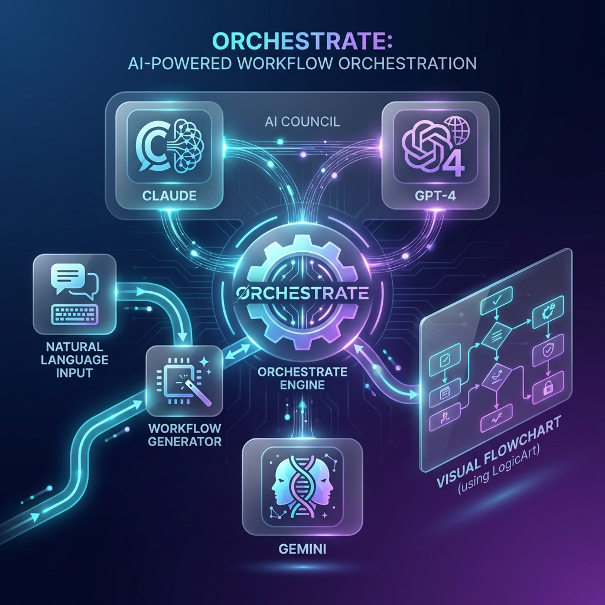
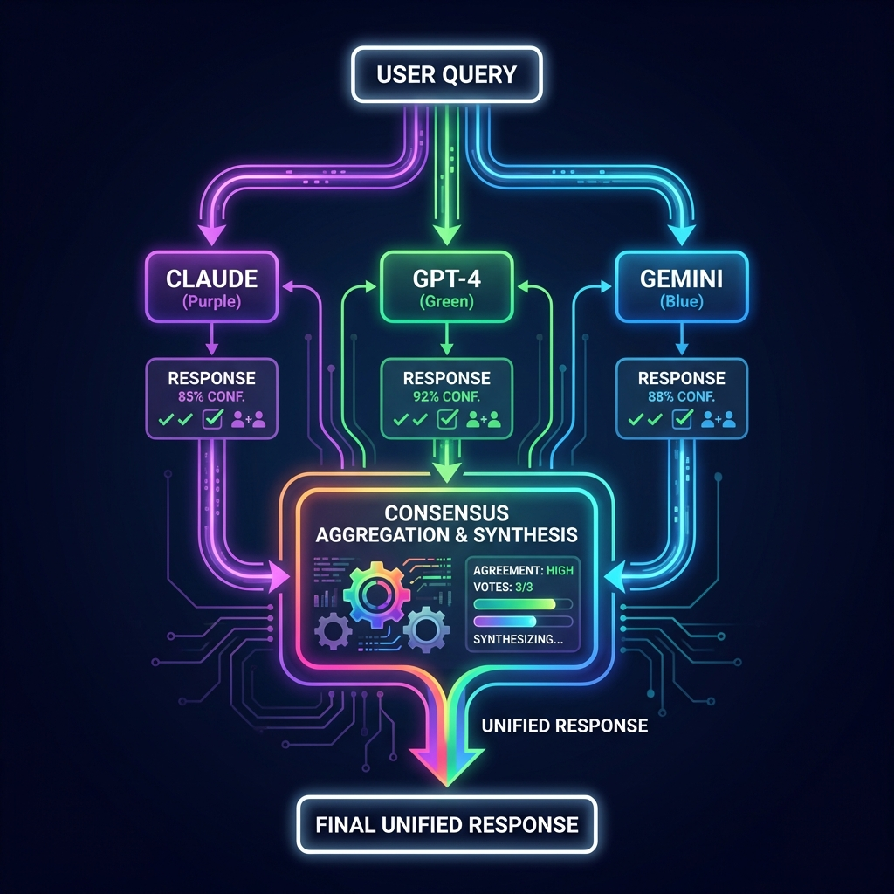
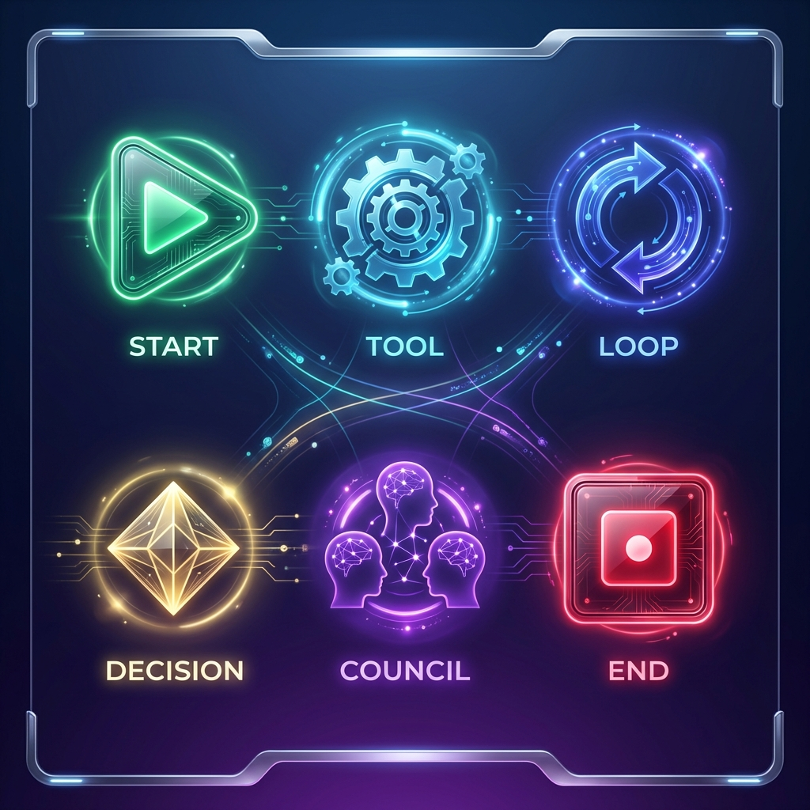

# Orchestrate Documentation

Visual workflow orchestration powered by AI. Design workflows in natural language, execute with Claude tools, visualize with LogicArt.



## Table of Contents

- [Quick Start](#quick-start)
- [Features](#features)
- [Claude Desktop / Cowork Setup](#claude-desktop--cowork-setup)
- [API Reference](#api-reference)
- [Workflow Schema](#workflow-schema)
- [Examples](#examples)

---

## Quick Start

### 1. Connect via Claude Desktop or Cowork

Add Orchestrate to your MCP configuration:

```json
{
  "mcpServers": {
    "orchestrate": {
      "command": "npx",
      "args": ["-y", "mcp-remote", "https://orchestrate.us.com/api/mcp/sse"]
    }
  }
}
```

### 2. Start Using Orchestrate

In Claude, you can now say:

- "Generate a workflow for processing customer feedback"
- "Visualize this workflow in LogicArt"
- "Ask the AI council about best practices for API design"

---

## Features

### Workflow Generation
Create workflows from natural language descriptions. Orchestrate uses AI to design node-based workflows automatically.

### LogicArt Visualization
Every workflow can be visualized as an interactive flowchart via LogicArt. Get shareable URLs instantly.

### 🧠 AI Council

<div align="center">
  
</div>

Query multiple AI models (Claude, GPT-4, Gemini) simultaneously and get **consensus** or comparative responses.

| Pattern | Description |
|---------|-------------|
| `consensus` | Synthesize unified answer from all models |
| `vote` | Majority wins for discrete choices |
| `compare` | Side-by-side analysis |
| `debate` | Models critique each other |

📄 **[Full AI Council Documentation →](AI_COUNCIL.md)**

### Persistence
Save and load workflows for later use. Build up a library of reusable automation templates.

### Web Search & Summarization
Built-in tools for searching the web and summarizing content within your workflows.

---

## Claude Desktop / Cowork Setup

### For Claude Desktop

1. Open Claude Desktop settings
2. Navigate to MCP Servers configuration
3. Add the Orchestrate server:

```json
{
  "mcpServers": {
    "orchestrate": {
      "command": "npx",
      "args": ["-y", "mcp-remote", "https://orchestrate.us.com/api/mcp/sse"]
    }
  }
}
```

4. Restart Claude Desktop

### For Cowork

Cowork uses the same MCP protocol. Add Orchestrate to your `.mcp.json` file:

```json
{
  "mcpServers": {
    "orchestrate": {
      "type": "sse",
      "url": "https://orchestrate.us.com/api/mcp/sse"
    }
  }
}
```

---

## API Reference

### MCP Endpoints

| Endpoint | Method | Description |
|----------|--------|-------------|
| `/api/mcp/sse` | GET | SSE connection for real-time communication |
| `/api/mcp/sse` | POST | Direct JSON-RPC requests |
| `/api/mcp/tools` | GET | List available tools |
| `/api/mcp/call` | POST | Execute a tool directly |

### Available Tools

#### generate_workflow
Generate a workflow from natural language.

```json
{
  "name": "generate_workflow",
  "arguments": {
    "prompt": "Create a workflow that searches for news and summarizes it"
  }
}
```

#### visualize_workflow
Get a LogicArt URL for a workflow.

```json
{
  "name": "visualize_workflow",
  "arguments": {
    "workflow": { ... }
  }
}
```

#### council_query
Query multiple AI models.

```json
{
  "name": "council_query",
  "arguments": {
    "query": "What are the best practices for REST API design?",
    "models": ["claude", "gpt4", "gemini"]
  }
}
```

#### save_workflow
Save a workflow to storage.

```json
{
  "name": "save_workflow",
  "arguments": {
    "workflow": { ... }
  }
}
```

#### load_workflow
Load a workflow by ID.

```json
{
  "name": "load_workflow",
  "arguments": {
    "id": "workflow-id"
  }
}
```

#### list_workflows
List all saved workflows.

```json
{
  "name": "list_workflows",
  "arguments": {}
}
```

#### web_search
Search the web.

```json
{
  "name": "web_search",
  "arguments": {
    "query": "latest AI news"
  }
}
```

#### summarize
Summarize text content.

```json
{
  "name": "summarize",
  "arguments": {
    "text": "Long text to summarize..."
  }
}
```

---

## Workflow Schema

Workflows follow this structure:

```typescript
interface Workflow {
  id: string;
  name: string;
  description: string;
  version: string;
  config: {
    timeout?: number;
    maxParallelism?: number;
    continueOnError?: boolean;
  };
  inputs: Array<{
    name: string;
    label: string;
    type: string;
    required: boolean;
    defaultValue?: any;
  }>;
  outputs: Array<{
    name: string;
    label: string;
    type: string;
    sourceNodeId: string;
  }>;
  nodes: Array<{
    id: string;
    type: 'start' | 'end' | 'tool' | 'decision' | 'loop' | 'parallel' | 'join' | 'human' | 'council';
    label: string;
    description?: string;
    config: any;
    position?: { x: number; y: number };
  }>;
  edges: Array<{
    id: string;
    sourceNodeId: string;
    targetNodeId: string;
    label?: string;
    condition?: {
      operator: 'equals' | 'notEquals' | 'contains' | 'greaterThan' | 'lessThan' | 'isEmpty' | 'isNotEmpty' | 'isTrue' | 'isFalse';
      value?: any;
    };
  }>;
  startNodeId: string;
  metadata: {
    author?: string;
    createdAt: string;
    updatedAt: string;
    tags?: string[];
    visibility: 'private' | 'team' | 'public';
  };
}
```

### Node Types



| Type | Description |
|------|-------------|
| `start` | Entry point of the workflow |
| `end` | Exit point of the workflow |
| `tool` | Executes a tool (web_search, summarize, etc.) |
| `decision` | Conditional branching based on data |
| `loop` | Iterate over items |
| `parallel` | Split into parallel branches |
| `join` | Merge parallel branches |
| `human` | Wait for human input |
| `council` | Query AI council for consensus |

---

## Examples

All example workflows are located in `src/examples/`:

| File | Description |
|------|-------------|
| `data-processing-pipeline.json` | Search, process, and summarize data with conditional branching |
| `approval-workflow.json` | Human-in-the-loop document review and approval |
| `parallel-research.json` | Search multiple topics simultaneously and combine results |
| `code-review-workflow.json` | Use AI Council for comprehensive code review |
| `council-research.json` | Query Claude, GPT-4, and Gemini for research synthesis |
| `research-workflow.json` | Basic research workflow template |

---

## Use Cases

### For Developers
- Automate code review processes
- Generate documentation workflows
- Create CI/CD integration templates

### For Researchers
- Multi-source research synthesis
- Parallel data gathering
- AI-assisted literature review

### For Teams
- Approval and review workflows
- Knowledge base automation
- Report generation pipelines

### For Content Creators
- Content research and summarization
- Multi-platform publishing workflows
- SEO analysis automation

---

## Support

Orchestrate is integrated with:
- **Claude Desktop** - MCP protocol
- **Cowork** - Agentic workflows
- **LogicArt** - Visual workflow editor
