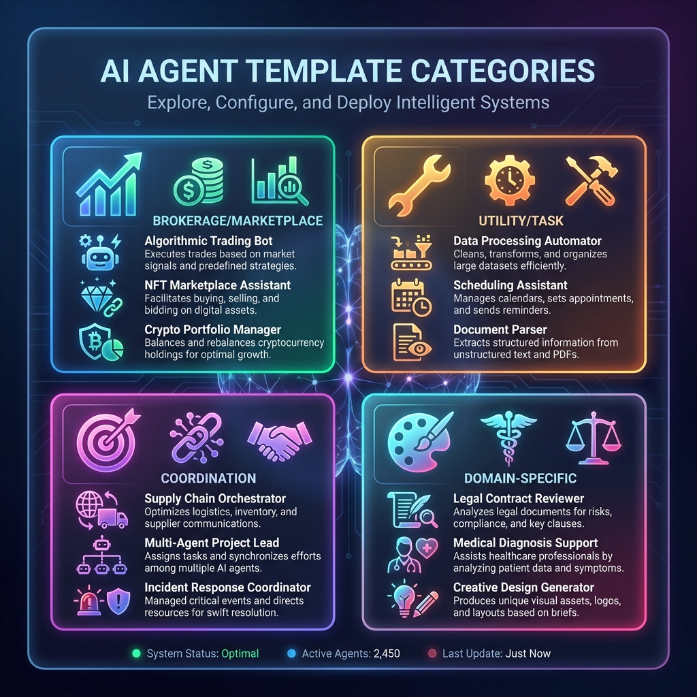

# 🤖 Orchestrate Agent Templates

<div align="center">
  
  <p><em>Pre-built agent workflows ready to deploy</em></p>
</div>

---

## Overview

Orchestrate provides a library of **12 production-ready agent templates** across four categories. Each template includes a complete workflow definition with nodes, edges, swimlanes, and agent configuration schemas.

---

## 📂 Template Categories

### 💹 Brokerage / Marketplace
Agents that compare prices and transact across multiple providers.

| Template | Description | Integrations |
|----------|-------------|--------------|
| **Compute Broker** | Aggregate GPU prices across providers, route jobs to cheapest option | Vast.ai, TensorDock, RunPod, Akash |
| **Table Broker** | Find and book restaurant reservations based on preferences | OpenTable, Resy, Tock, Tablz |
| **Prediction Trader** | Monitor prediction markets, identify arbitrage, execute trades | Polymarket, Kalshi, Manifold Markets |

---

### 🔧 Utility / Task
General-purpose workhorses for common automation tasks.

| Template | Description | Complexity |
|----------|-------------|------------|
| **Echo Agent** | Simple request/response — reference implementation | Low |
| **Research Agent** | Web search, multi-source research, synthesize findings | Medium |
| **Data Transform** | Convert between formats, clean data, validate schemas | Low |

---

### 🎯 Coordination
Agents that manage other agents, resources, and schedules.

| Template | Description | Integrations |
|----------|-------------|--------------|
| **Scheduler Agent** | Manage calendars, find mutual availability, book meetings | Google Calendar, Microsoft Graph, Calendly |
| **Moderator Agent** | Review content, flag issues, enforce community guidelines | Perspective API, OpenAI Moderation |
| **Orchestrator Agent** | Break complex tasks into subtasks, delegate, aggregate results | All agent types |

---

### 🎨 Domain-Specific
Specialized agents for specific industries and use cases.

| Template | Description | Integrations |
|----------|-------------|--------------|
| **Code Review** | Analyze code, identify issues, suggest improvements | GitHub, GitLab, LLM APIs |
| **Meeting Summarizer** | Process transcripts, extract key points and action items | Otter.ai, Rev, Calendar APIs |
| **Price Monitor** | Track prices across sources, alert on thresholds | E-commerce APIs, Notification services |

---

## 🏗️ Template Structure

Each template contains:

```json
{
  "id": "template-id",
  "name": "Human Readable Name",
  "description": "What this agent does",
  "category": "brokerage | utility | coordination | domain",
  "complexity": "low | medium | high",
  "commands": ["command1", "command2 [arg]"],
  "integrations": ["API 1", "API 2"],
  "nodes": [...],
  "edges": [...],
  "swimlanes": [...],
  "agentConfig": {
    "agentId": "unique-id",
    "capabilities": ["cap1", "cap2"],
    "inputSchema": {...},
    "outputSchema": {...}
  }
}
```

---

## 🔗 Workflow Components

### Nodes

| Type | Icon | Description |
|------|------|-------------|
| `event` | ⚡ | Triggers and outputs (start/end points) |
| `task` | 📋 | Work to be performed |
| `gateway` | 🔀 | Decision points with multiple paths |

### Edges

Connect nodes with optional labels for conditional flows:

```json
{
  "source": "gateway-node",
  "target": "success-node",
  "label": "Yes"
}
```

### Swimlanes

Organize workflows by actor or responsibility:

```json
{
  "id": "user",
  "label": "User"
},
{
  "id": "agent",
  "label": "Orchestrator Agent"
}
```

---

## 📊 Usage with LogicArt

Templates are designed for visualization in [LogicArt](https://logicart.us.com):

```javascript
// Load template
const template = templates.find(t => t.id === 'orchestrator-agent');

// Visualize workflow
LogicArt.visualizeWorkflow({
  nodes: template.nodes,
  edges: template.edges,
  swimlanes: template.swimlanes
});
```

---

## 🚀 Example: Orchestrator Agent

The most complex template — breaks tasks into subtasks and delegates to specialized agents:

```
┌─────────────┐     ┌─────────────┐     ┌─────────────┐
│ Complex     │────▶│ Create      │────▶│ Delegate    │
│ Task        │     │ Plan        │     │ Step 1-3    │
└─────────────┘     └─────────────┘     └──────┬──────┘
                                               │
                                        ┌──────▼──────┐
                                        │ Aggregate   │
                                        │ Results     │
                                        └──────┬──────┘
                                               │
                                        ┌──────▼──────┐
                                        │ Return      │
                                        │ Result      │
                                        └─────────────┘
```

**Commands:**
- `plan [task]` — Decompose task into steps
- `delegate [step] to [agent]` — Send to specialist
- `status [task-id]` — Check progress
- `aggregate [task-id]` — Combine results

---

## 📋 Quick Start

### 1. List Available Templates

```bash
curl https://orchestrate.us.com/api/templates
```

### 2. Get Specific Template

```bash
curl https://orchestrate.us.com/api/templates/orchestrator-agent
```

### 3. Deploy Template

```javascript
const response = await fetch('/api/agents/deploy', {
  method: 'POST',
  body: JSON.stringify({
    templateId: 'orchestrator-agent',
    config: {
      name: 'my-orchestrator',
      webhookUrl: 'https://my-app.com/webhook'
    }
  })
});
```

---

## 🔗 Related Resources

- [Orchestrate Documentation](docs.html) — Full API reference
- [LogicArt Visualization](https://logicart.us.com) — Workflow diagrams
- [Quack Messaging](https://quack.us.com) — Agent-to-agent communication

---

<div align="center">
  <strong>Orchestrate</strong> — Build powerful AI workflows from proven templates
</div>
